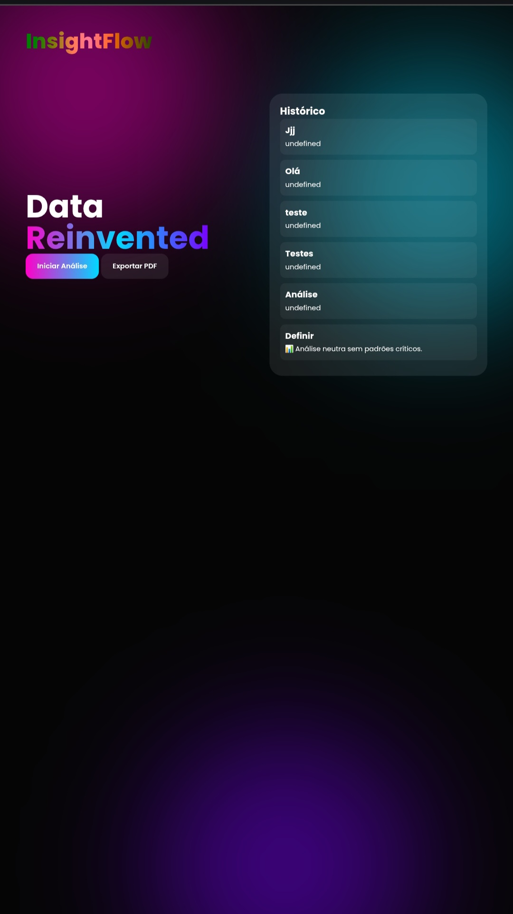

# Do Clone ao Produto Mínimo Viável (MVP+)

# 🚀 InsightFlow

> Plataforma inteligente de análise de dados com IA simulada, Firebase e exportação de relatórios em PDF.

---

## 📌 Sobre o Projeto

O **InsightFlow** é uma aplicação web desenvolvida como parte de uma atividade acadêmica envolvendo engenharia reversa, desenvolvimento assistido por IA e integração com serviços em nuvem.

O sistema permite inserir textos, que são analisados automaticamente por um mecanismo de inteligência simulada baseado em regras, gerando insights e armazenando os resultados na nuvem.

## 📂 Código do Projeto

O código-fonte completo do sistema está disponível na pasta:

📁 `codigo-fonte/index do projeto`

Essa separação foi feita para organização do projeto e melhor manutenção do repositório.

---

## 🖼️ Evidência Visual do Sistema

### 📍 Interface do InsightFlow em execução

> *Figura 1: Interface principal do sistema com histórico de análises e painel de interação.*

---

## 🎯 Objetivo

Transformar uma ferramenta baseada em referência externa em um produto autoral, adicionando funcionalidades próprias, identidade visual e integração com tecnologias modernas.

---

## ⚙️ Funcionalidades

- 🧠 Análise inteligente de texto (IA simulada)
- ☁️ Integração com Firebase Firestore
- 📚 Histórico dinâmico de análises
- 📄 Exportação de relatórios em PDF
- 🎨 Interface moderna com animações e glassmorfismo

---

## 🛠️ Tecnologias Utilizadas

- HTML5
- CSS3
- JavaScript (Vanilla)
- Firebase Firestore
- jsPDF

---

## 🔥 Diferenciais do Projeto

- Sistema de análise automatizada por palavras-chave
- Persistência de dados em nuvem
- Interface moderna com design futurista
- Geração de relatórios em PDF
- Estrutura de aplicação web real (estilo SaaS)

---

## 🧠 Respostas da Parte Teórica

### 📌 Questão A — Formação do Desenvolvedor na Era da IA

O desenvolvimento moderno com IA altera o foco da escrita de código para a definição lógica de soluções. O desenvolvedor passa a atuar como um orientador de sistemas inteligentes.

Duas competências essenciais são:

- Pensamento lógico e modelagem de problemas
- Capacidade de validação crítica do código gerado por IA

---

### 📌 Questão B — Originalidade vs. Plágio Digital

A engenharia reversa assistida por IA se torna plágio digital quando há reprodução direta de interfaces e funcionalidades sem inovação ou contribuição própria.

Uma diretriz ética adequada é:

> “Recriar, melhorar e diferenciar”

Isso garante o uso da tecnologia como aprendizado sem comprometer a originalidade.

---

## 📂 Estrutura do Projeto
/insightflow
│
├── Index.html
├── README.md
    
---

## 📌 Link do Projeto

🔗 https://github.com/Gimenez201/insightflow

---

## 👨‍💻 Autor

**Gustavo Gimenez**  
Curso: Ciência da Computação  
Instituição:📍 UNICID

[⬅ Voltar ao Portfólio Principal](../README.md)
