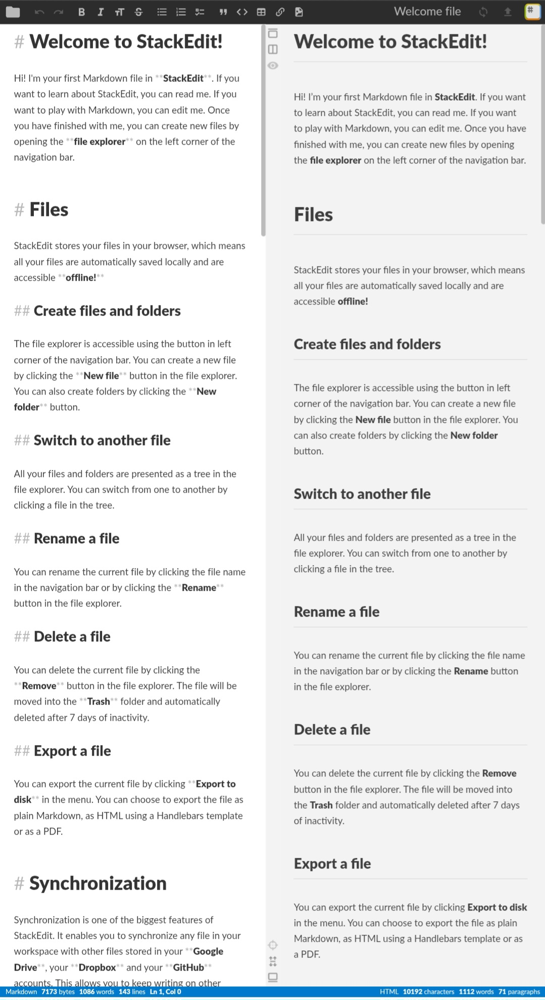

# Laboratório de Engenharia Reversa

# 🤖 Engenharia Reversa Assistida por IA

> Projeto acadêmico voltado à análise de desenvolvimento assistido por Inteligência Artificial, engenharia reversa de interfaces e reflexão ética sobre IA generativa aplicada à Engenharia de Software.

---

## 📝 Descrição do Projeto

Este projeto explora o uso de Inteligência Artificial Generativa no processo de reconstrução funcional de aplicações web a partir da observação de sua interface externa, sem acesso ao código-fonte original.

A atividade foi desenvolvida utilizando ferramentas de IA como o Google AI Studio (Gemini), com foco em engenharia de prompts, descrição lógica de sistemas e desenvolvimento assistido por IA. O objetivo principal consistiu em analisar um webapp de referência, compreender seu comportamento visual e funcional e orientar uma IA para gerar uma aplicação semelhante utilizando tecnologias web modernas.

Além da reconstrução funcional, o projeto também propõe uma análise crítica sobre:
- o impacto da IA na formação do engenheiro de software;
- a evolução do desenvolvimento orientado por prompts;
- os limites éticos da engenharia reversa assistida por IA;
- originalidade e plágio digital em aplicações geradas por modelos generativos.

---

## 🎯 Objetivos da Atividade

- Explorar o conceito de desenvolvimento assistido por IA.
- Utilizar engenharia de prompts para geração de software.
- Reconstruir funcionalidades a partir da análise visual de interfaces.
- Refletir sobre ética, originalidade e propriedade intelectual.
- Compreender o impacto da IA na formação do desenvolvedor moderno.

---

## 🚀 Tecnologias e Ferramentas Utilizadas

### 🤖 Inteligência Artificial


### 💻 Desenvolvimento Web


### 🛠 Ferramentas Complementares

- StackEdit
- Google AI Studio
- Navegador Web
- Engenharia de Prompts

---

## 🧪 Metodologia Aplicada

### 1️⃣ Análise da Interface

Foi realizada a exploração visual e funcional de uma aplicação web de referência, identificando:
- componentes gráficos;
- comportamento da interface;
- fluxo de interação do usuário;
- estrutura lógica do sistema.

---

### 2️⃣ Configuração da IA

Utilizando o Google AI Studio, foram definidas instruções específicas para que o modelo Gemini atuasse como um desenvolvedor Full-Stack, gerando:
- estrutura HTML;
- estilização CSS;
- componentes React;
- comportamento JavaScript.

---

### 3️⃣ Reconstrução Funcional

A IA foi utilizada para gerar uma aplicação semelhante à interface analisada, utilizando descrições detalhadas sobre:
- aparência;
- lógica de funcionamento;
- comportamento dos elementos;
- experiência do usuário.

---

### 4️⃣ Validação e Ajustes

Após a geração inicial, o sistema foi testado e refinado através de ajustes nos prompts, melhorando:
- fidelidade visual;
- comportamento funcional;
- organização estrutural do software.

---

## 📸 Interface Utilizada Durante o Experimento



*Figura 1: Interface utilizada como referência visual durante o processo de engenharia reversa assistida por IA.*

---

## 🧠 Reflexão Sobre Desenvolvimento Assistido por IA

O experimento demonstrou que ferramentas generativas estão transformando profundamente o processo de desenvolvimento de software. Em vez de focar exclusivamente na escrita manual de código, o profissional moderno passa a atuar também na descrição lógica e funcional dos sistemas.

Nesse contexto, competências como:
- engenharia de prompts;
- pensamento crítico;
- validação de resultados;
- capacidade analítica;
- interpretação de requisitos;

tornam-se essenciais para que o desenvolvedor consiga utilizar IA de forma eficiente e estratégica.

A atividade também evidencia que a Inteligência Artificial não substitui totalmente o desenvolvedor, mas altera significativamente a forma como software é projetado, estruturado e validado.

---

## ⚠️ Ética e Originalidade no Uso de IA

A facilidade de replicar interfaces e funcionalidades através de IA levanta discussões importantes sobre autoria e originalidade no desenvolvimento de software.

A engenharia reversa pode ser considerada uma ferramenta legítima de aprendizado, estudo e prototipagem quando utilizada para fins educacionais ou experimentais. Entretanto, a prática passa a representar plágio digital quando há reprodução quase idêntica de identidade visual, comportamento ou estrutura funcional sem autorização ou transformação significativa.

Como diretriz ética, o projeto propõe:
- utilização da IA como ferramenta de aprendizado;
- adaptação criativa das referências analisadas;
- reconhecimento das inspirações utilizadas;
- desenvolvimento de soluções originais a partir das ideias observadas.

Essa abordagem permite equilibrar inovação tecnológica e respeito à propriedade intelectual.

---

## 📚 Aprendizados Obtidos

Durante o desenvolvimento desta atividade, foi possível compreender:
- o funcionamento do desenvolvimento assistido por IA;
- a importância da engenharia de prompts;
- como modelos generativos interpretam descrições funcionais;
- os desafios éticos relacionados à IA no desenvolvimento;
- a transformação do papel do engenheiro de software moderno.

O projeto também reforçou conceitos relacionados à criatividade computacional, validação humana e responsabilidade tecnológica.

---

## 🔧 Estrutura do Projeto

```bash
engenharia-reversa-com-ia/
│
├── README.md
└── stackedit-interface.png
```

---

## 🔗 Ferramentas e Referências

- Google AI Studio
- Google Gemini
- StackEdit
- Neumorphism.io
- Blobmaker
- Conceitos de Engenharia Reversa
- Estudos sobre IA Generativa e Engenharia de Software

---

## 👨‍💻 Autor

**Gustavo Gimenez**  
Estudante de **Ciência da Computação**  
📍 **UNICID**

---

[⬅ Voltar ao Portfólio Principal](../README.md)
